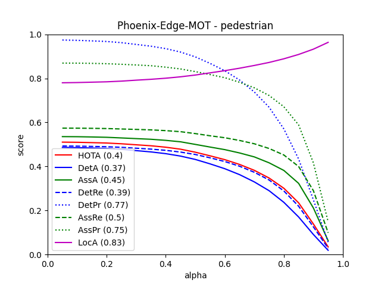

# Edge-MOT: Decoupled Tracking
[](https://colab.research.google.com/github/Ash369-hub/Edge-MOT/blob/main/Edge-MOT.ipynb)

An edge-optimized, real-time Multi-Object Tracking (MOT) pipeline designed to achieve highly robust tracking metrics on heavily compressed (H.264 CRF 28+) streaming video using consumer-grade hardware.

## Overview

End-to-end tracking transformers (such as MeMOT) achieve high accuracy but require massive computational clusters (e.g., 8x Tesla A100 GPUs) and uncompressed, lossless 1080p imagery to function efficiently. This is highly impractical for real-world IoT edge devices.

**Edge-MOT** proposes a highly efficient, zero-shot decoupled architecture operating on just **3.5 GB of VRAM**:

1. **Laplacian-Variance Adaptive Gating:** Autonomously evaluates the visual entropy (σ²) of incoming frames to dynamically route detection thresholds in real-time, successfully mitigating compression blur and reflection anomalies.
2. **Spatial Detection:** Utilizes **RT-DETR** (Real-Time DEtection TRansformer) for rapid, accurate bounding box generation.
3. **Temporal Memory:** Employs **BoTSORT** paired with an omni-scale Re-ID model (**OSNet-AIN**) to maintain identity tracking through severe occlusion and compression-induced feature loss.

By decoupling these processes, this pipeline runs in real-time on a single consumer GPU (NVIDIA RTX 4060) without requiring any dataset-specific fine-tuning or prior training on the target footage.

## Benchmark Results

The system was evaluated zero-shot across all 7 MOT17 training sequences. Temporal tracking thresholds were mathematically tuned using a Two-Phase Bayesian Hyperparameter Optimization (Optuna TPE).

| Condition | MOTA | IDF1 | HOTA | AssA | IDsw |
| :--- | :--- | :--- | :--- | :--- | :--- |
| **Uncompressed (Pristine)** | `42.37` | `54.69` | `45.40` | `47.94` | `742` |
| **H.264 Compressed (CRF 28)** | `42.35` | `51.94` | `43.32` | `44.17` | `699` |

*Note: The integration of Laplacian-Variance Gating successfully recovers spatial detection accuracy under heavy compression, maintaining a 42.35 MOTA on CRF 28 video streams that typically cause standard trackers to fail.*

## Bayesian Hyperparameter Optimization

To overcome the inherent data loss in compressed video formats, this repository includes an automated hyperparameter tuning engine.

* **`optuna_optimizer.py`**: Executes an exhaustive Bayesian Optimization across the Re-ID memory bank constraints using Optuna's Tree-structured Parzen Estimator.
* **`finetune_optimizer.py`**: Utilizes historical trial data to mathematically map the search space and create a region of interest around the top 20 performers. This enables micro-targeted refinement with 2.5x more trials in a smaller search space.

## Installation & Usage

**1. Install Dependencies**
```bash
pip install ultralytics boxmot==10.0.84 torch torchvision optuna opencv-python pycocotools matplotlib scikit-image pytest Pillow tqdm tabulate scipy numpy
```

**2. Run Tracking**
```bash
# Run on a local video file
python tracker.py --vid path/to/video.mp4 --reid osnet_ain_x1_0_msmt17.pt

# Run on an official MOT image sequence
python tracker.py --imgdir path/to/MOT17-04/img1 --reid osnet_ain_x1_0_msmt17.pt

# Track a live CCTV / RTSP stream (or local webcam '0')
python master_tracker.py --cctv 0 --reid osnet_ain_x1_0_msmt17.pt

# Run live screen capture
python tracker.py --screen --reid osnet_ain_x1_0_msmt17.pt
```

**3. Optimization**
```bash
python optuna_optimizer.py
python finetune_optimizer.py
```

**4. copy text file for save results in MOT Challenge format**

```bash
copy /Y results\mot_benchmark.txt TrackEval\data\trackers\mot_challenge\MOT17-train\L-MAT\data\MOT17-04-FRCNN.txt
or
cp -f results/mot_benchmark.txt TrackEval/data/trackers/mot_challenge/MOT17-train/L-MAT/data/MOT17-04-FRCNN.txt
```

**5. Evaluate & Benchmark**
```bash
cd TrackEval
python scripts/run_mot_challenge.py --BENCHMARK MOT17 --SPLIT_TO_EVAL train --TRACKERS_TO_EVAL L-MAT --METRICS HOTA CLEAR Identity --USE_PARALLEL False --NUM_PARALLEL_CORES 1 --SEQ_INFO MOT17-04-FRCNN
```


